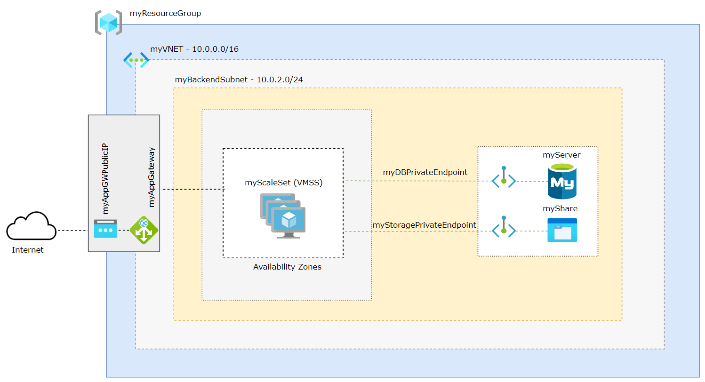

# Deploy a highly available and scalable Wordpress on Azure

This example scenario is a guidance on how to deploy a highly available and scalable Wordpress on Azure using Application Gateway that uses a Virtual Machine Scale Set for backend servers and all deployed into 3 [Availability Zones](https://docs.microsoft.com/en-us/azure/availability-zones/az-overview#availability-zones) to ensure availability and scalability.

Those backend servers will be hosting a [Wordpress](https://wordpress.com/) configured over a NFS Share on [Azure Files](https://docs.microsoft.com/en-us/azure/storage/files/storage-files-introduction) service and connected to an [Azure Database for MySQL](https://docs.microsoft.com/en-us/azure/mysql/overview) service.

To connect the VMs to the MySQL and NFS Share services, two [Azure Private Endpoints](https://docs.microsoft.com/en-us/azure/private-link/private-endpoint-overview) will be configured to connect them privately and securely.

# Architecture



# Prerequisites

* Use the Bash environment in [Azure Cloud Shell](https://docs.microsoft.com/en-us/azure/cloud-shell/quickstart).

[](http://shell.azure.com/)

* If you prefer, [install](https://docs.microsoft.com/en-us/cli/azure/install-azure-cli) the Azure CLI to run CLI reference commands.

* This tutorial requires version 2.0.4 or later of the Azure CLI. If using Azure Cloud Shell, the latest version is already installed.

# Define Variables

```
subscriptionId="XXXXXXXX-XXXX-XXXX-XXXX-XXXXXXXXXXXX"
resourceGroupName="myResourceGroup"
storageAccountName="mystorageacct$RANDOM"
region="westus2"
shareName="myshare$RANDOM"
mysqlServerName="myserver$RANDOM"
mysqlAdmin="myadmin"
mysqlPassword="MyWeaKPassw0rd"
privateEndpointNameStorage="myStoragePrivateEndpoint"
privateConnectionNameStorage="myStorageConnection"
privateDNSZoneNameStorage="privatelink.file.core.windows.net"
privateDNSZoneGroupNameStorage="MyStorageZoneGroup"
privateDNSLinkNameStorage="MyStorageDNSLink"
privateEndpointNameDatabase="myDatabasePrivateEndpoint"
privateConnectionNameDatabase="myDatabaseConnection"
privateDNSZoneNameDatabase="privatelink.mysql.database.azure.com"
privateDNSLinkNameDatabase="MyDatabaseDNSLink"
privateDNSZoneGroupNameDatabase="MyDatabaseZoneGroup"
dbname="wordpressdb"
dbuser="db_user"
dbpassword="db_user-weakPassword"
ScaleSetName="myScaleSet"
VNETName="myVNET"
SubnetName="mySubnet"
BackendSubnetName="myBackendSubnet"
AppGWPublicIPAddressName="myAppGWPublicIP" 
AppGatewayName="myAppGateway"
```
# Create Resource Group
```
az group create --name $resourceGroupName --location $region
```
# Create a VNET
```
az network vnet create \
    --resource-group $resourceGroupName\
    --location $region \
    --name $VNETName \
    --address-prefixes 10.0.0.0/16 \
    --subnet-name $SubnetName  \
    --subnet-prefixes 10.0.0.0/24
```
_Please note that the subnet created here will be the [dedicated subnet](https://docs.microsoft.com/en-us/azure/application-gateway/configuration-infrastructure#virtual-network-and-dedicated-subnet) to Application Gateway_

# Create a Backend Subnet
```
az network vnet subnet create \
  --name $BackendSubnetName \
  --resource-group $resourceGroupName \
  --vnet-name $VNETName \
  --address-prefix 10.0.2.0/24 
 ```
 #  Create a Public IP for the Application Gateway
 ```
 az network public-ip create \
  --resource-group $resourceGroupName \
  --name $AppGWPublicIPAddressName \
  --allocation-method Static \
  --sku Standard \
  --zone 1 2 3
  ```
  # Update the backend subnet 
  Is required to disable network policies for private endpoints
  ```
  az network vnet subnet update \
    --name $BackendSubnetName \
    --resource-group $resourceGroupName \
    --vnet-name $VNETName \
    --disable-private-endpoint-network-policies true
```
# Create the Application Gateway
```
az network application-gateway create \
  --name $AppGatewayName \
  --location $region \
  --resource-group $resourceGroupName \
  --vnet-name $VNETName \
  --subnet $SubnetName \
  --capacity 3 \
  --sku Standard_v2 \
  --http-settings-cookie-based-affinity Enabled \
  --frontend-port 80 \
  --http-settings-port 80 \
  --http-settings-protocol Http \
  --public-ip-address $AppGWPublicIPAddressName \
  --zones 1 2 3
  ```
# Create FileStorage Accout
```
az storage account create \
    --resource-group $resourceGroupName \
    --name $storageAccountName \
    --kind FileStorage \
    --sku Premium_ZRS 
```
# Create an NFS share  
```
az storage share-rm create \
    --resource-group $resourceGroupName \
    --storage-account $storageAccountName \
    --name $shareName \
    --enabled-protocol NFS \
    --root-squash NoRootSquash \
    --quota 1024 
```
# Create a Private Endpoint to use with Azure FileStorage
```
idstorage=$(az storage account list \
    --resource-group $resourceGroupName \
    --query '[].[id]' \
    --output tsv)

az network private-endpoint create \
    --name $privateEndpointNameStorage \
    --resource-group $resourceGroupName \
    --vnet-name $VNETName \
    --subnet $BackendSubnetName \
    --private-connection-resource-id $idstorage \
    --connection-name $privateConnectionNameStorage \
    --group-id file
```
# Configure the private DNS zone for Azure FileStorage
```
az network private-dns zone create \
    --resource-group $resourceGroupName \
    --name $privateDNSZoneNameStorage

az network private-dns link vnet create \
    --resource-group  $resourceGroupName \
    --zone-name $privateDNSZoneNameStorage \
    --name $privateDNSLinkNameStorage \
    --virtual-network $VNETName \
    --registration-enabled false

az network private-endpoint dns-zone-group create \
   --resource-group $resourceGroupName \
   --endpoint-name $privateEndpointNameStorage \
   --name $privateDNSZoneGroupNameStorage \
   --private-dns-zone $privateDNSZoneNameStorage \
   --zone-name storage
```
# Disable secure transfer setting on Storage Account
 The secure transfer setting isn't supported on NFS protocol, so it's required to disable it:
```
az storage account update -g $resourceGroupName -n $storageAccountName --https-only false
```
# Register your subscription to use the NFS 4.1 protocol
As NFS is a preview feature at this time, you need register your subscription to be able to use.
```
az feature register \
    --name AllowNfsFileShares \
    --namespace Microsoft.Storage \
    --subscription $subscriptionId

az provider register \
    --namespace Microsoft.Storage
```
# Create MySQL
```
az mysql server create --resource-group $resourceGroupName --name $mysqlServerName --location $region --admin-user $mysqlAdmin --admin-password $mysqlPassword --sku-name GP_Gen5_2 --ssl-enforcement Disabled
```
# Create a Private Endpoint to use with Azure Database for MySQL
```
idmysql=$(az mysql server list \
    --resource-group $resourceGroupName \
    --query '[].[id]' \
    --output tsv)


az network private-endpoint create \
    --name $privateEndpointNameDatabase \
    --resource-group $resourceGroupName \
    --vnet-name $VNETName \
    --subnet $BackendSubnetName \
    --private-connection-resource-id $idmysql \
    --group-id mysqlServer \
    --connection-name $privateConnectionNameDatabase
```
# Configure the Private DNS Zone for Azure Database for MySQL
```
az network private-dns zone create --resource-group $resourceGroupName \
   --name  $privateDNSZoneNameDatabase 

az network private-dns link vnet create --resource-group $resourceGroupName \
   --zone-name  $privateDNSZoneNameDatabase \
   --name $privateDNSLinkNameDatabase \
   --virtual-network $VNETName \
   --registration-enabled false

az network private-endpoint dns-zone-group create \
   --resource-group $resourceGroupName \
   --endpoint-name $privateEndpointNameDatabase \
   --name $privateDNSZoneGroupNameDatabase \
   --private-dns-zone $privateDNSZoneNameDatabase \
   --zone-name mysql
```
# Create a firewall rule on Azure Database for MySQL
This will allow connect on Azure Database from AZ CLI to create the database 
```
az mysql server firewall-rule create --resource-group $resourceGroupName --server $mysqlServerName --name "AllowAll" --start-ip-address 0.0.0.0 --end-ip-address 0.0.0.0
```
# Create a database with a non-admin user in Azure Database for MySQL
```
mysql -h $mysqlServerName.mysql.database.azure.com -u$mysqlAdmin@$mysqlServerName -p$mysqlPassword<<EOFMYSQL
CREATE DATABASE wordpressdb;
CREATE USER 'db_user'@'%' IDENTIFIED BY 'db_user-weakPassword';
GRANT ALL PRIVILEGES ON wordpressdb . * TO 'db_user'@'%';
FLUSH PRIVILEGES;
EOFMYSQL
```
# Remove the firewall rule previously created to create the database from AZ CLI. 
As the access from VMs to the database will use the private endpoint connection, we don't need it anymore. Was required just to be able to connet to MySQL from AZ CLI and create the Wordpress database.
```
az mysql server firewall-rule delete --name AllowAll --resource-group $resourceGroupName --server-name $mysqlServerName -y
```
# Generate cloud-init
At this step the cloud-init will be generated to create the configuration inside the VMs and install required packages.
```
cat <<EOF > cloud-init.txt
#cloud-config
package_upgrade: true
packages:
  - nginx
  - php-curl
  - php-gd
  - php-intl
  - php-mbstring
  - php-soap
  - php-xml
  - php-xmlrpc
  - php-zip
  - php-fpm
  - php-mysql
  - nfs-common

write_files:
- path: /tmp/wp-config.php
  content: |
      <?php
      define('DB_NAME', '$dbname');
      define('DB_USER', '$dbuser');
      define('DB_PASSWORD', '$dbpassword');
      define('DB_HOST', '$mysqlServerName.mysql.database.azure.com');
      \$table_prefix = 'wp_';
      if ( ! defined( 'ABSPATH' ) ) {
        define( 'ABSPATH', __DIR__ . '/' );
      }
      require_once ABSPATH . 'wp-settings.php';
      ?>


- path: /tmp/wordpress.conf
  content: |
   server {
      listen 80;
      server_name _;
      root /data/nfs/wordpress;

      index index.html index.htm index.php;

      location / {
          try_files \$uri \$uri/ /index.php\$is_args\$args;
      }

      location ~ \.php$ {
          include snippets/fastcgi-php.conf;
          fastcgi_pass unix:/var/run/php/php7.2-fpm.sock;
      }

      location = /favicon.ico { log_not_found off; access_log off; }
      location = /robots.txt { log_not_found off; access_log off; allow all; }
      location ~* \.(css|gif|ico|jpeg|jpg|js|png)$ {
        expires max;
        log_not_found off;
      }

      location ~ /\.ht {
          deny all;
      }

   }

runcmd: 
  - mkdir -p /data/nfs/wordpress
  - mount -t nfs $storageAccountName.file.core.windows.net:/$storageAccountName/$shareName /data/nfs -o vers=4,minorversion=1,sec=sys
  - wget http://wordpress.org/latest.tar.gz -P /data/nfs/wordpress
  - tar xzvf /data/nfs/wordpress/latest.tar.gz -C /data/nfs/wordpress --strip-components=1
  - cp /tmp/wp-config.php /data/nfs/wordpress/wp-config.php
  - cp /tmp/wordpress.conf  /etc/nginx/conf.d/wordpress.conf
  - chown -R www-data:www-data /data/nfs/wordpress
  - rm /etc/nginx/sites-enabled/default
  - rm /etc/nginx/sites-available/default
  - systemctl restart nginx
EOF
```
# Create a Virtual Machine Scale Set
```
az vmss create \
  --name $ScaleSetName \
  --resource-group $resourceGroupName \
  --image UbuntuLTS \
  --admin-username azureuser \
  --generate-ssh-keys \
  --instance-count 3 \
  --vnet-name $VNETName \
  --subnet $BackendSubnetName \
  --vm-sku Standard_DS2_v2 \
  --upgrade-policy-mode Automatic \
  --app-gateway $AppGatewayName \
  --custom-data cloud-init.txt \
  --backend-pool-name appGatewayBackendPool \
  --zones 1 2 3
 ```
 # Get the Application Gateway Public IP
```
az network public-ip show \
  --resource-group $resourceGroupName \
  --name $AppGWPublicIPAddressName \
  --query [ipAddress] \
  --output tsv
 ```
# Finish the Wordpress installation
In your web browser, navigate to the Application Gateway Public IP and complete the Wordpress installation through the web interface:
```
http://application_gateway_public_ip
```
Select the language you would like to use:


Next, you will come to the main setup page.

Select a name for your WordPress site and choose a username. It is recommended to choose something unique and avoid common usernames like “admin” for security purposes. A strong password is generated automatically. Save this password or select an alternative strong password.

Enter your email address and select whether you want to discourage search engines from indexing your site:


When you click ahead, you will be taken to a page that prompts you to log in:


Once you log in, you will be taken to the WordPress administration dashboard:


# Change manually the capacity of a scale set

When you created a Virtual Machine Scale, three VM instances were deployed by the parameter --instance-count 3. To increase or decrease the number of VM instances in your existing scale set, you can manually change the capacity. The scale set creates or removes the required number of VM instances then will distribute the traffic.

To manually increase or decrease the number of VM instances in the scale set, use az vmss scale. The following example sets the number of VM instances in your scale set to 5:
```
az vmss scale  --name myScaleSet --new-capacity 5 --resource-group $resourceGroupName
```
# Using autoscale profile to change the capacity automatically
```
az monitor autoscale create \
  --resource-group $resourceGroupName \
  --resource $ScaleSetName \
  --resource-type Microsoft.Compute/virtualMachineScaleSets \
  --name autoscale \
  --min-count 3 \
  --max-count 10 \
  --count 3
```
# Create a rule to autoscale out
```
az monitor autoscale rule create \
  --resource-group $resourceGroupName \
  --autoscale-name autoscale \
  --condition "Percentage CPU > 70 avg 5m" \
  --scale out 3
```
# Create a rule to autoscale in
```
az monitor autoscale rule create \
  --resource-group $resourceGroupName \
  --autoscale-name autoscale \
  --condition "Percentage CPU < 30 avg 5m" \
  --scale in 1
```
